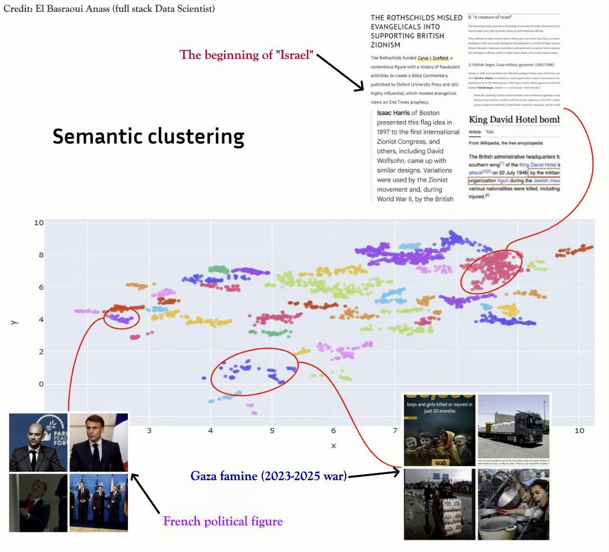
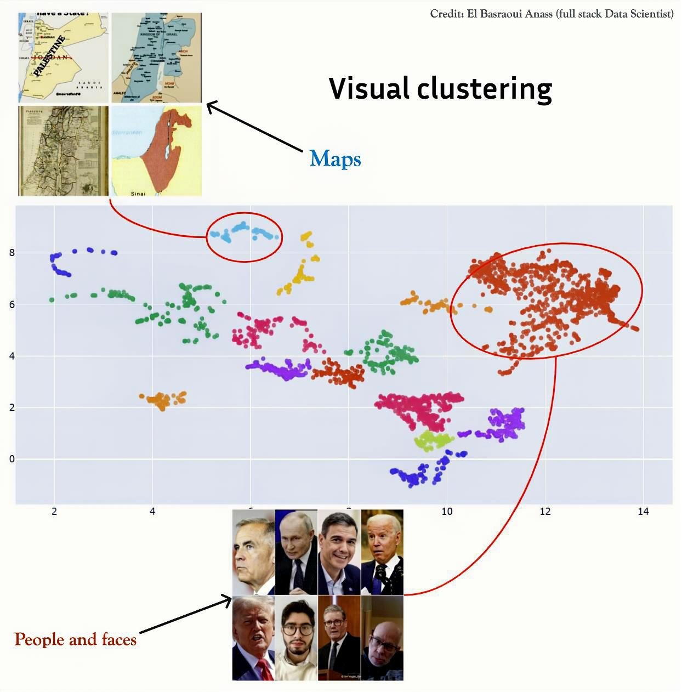
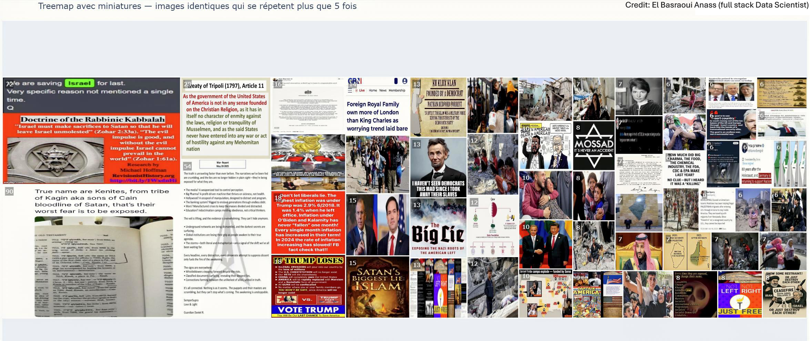

# Image Clustering Treemap

Explore how high-dimensional image embeddings can be grouped, narrated, and visualized through a compact end-to-end workflow.

## Notebook Tour
- **1_image_preparation_and_embeddings.ipynb** – Collect raw images, clean metadata, and generate multimodal embeddings ready for clustering.
- **2_visual_clustering.ipynb** – Project embeddings into 2D space and surface visually similar neighborhoods.
- **3_semantic_clustering.ipynb** – Detect text-driven themes to reveal hidden narratives inside the collection.
- **4_treemap.ipynb** – Assemble clusters into a treemap dashboard for an at-a-glance overview of repeating imagery.

## Highlights

Dive into the notebooks to adapt the pipeline to your own datasets and craft story-driven visual analytics experiences.
